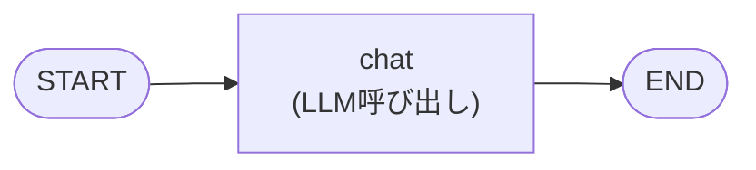
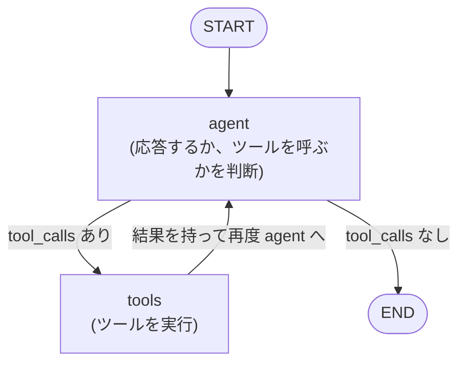
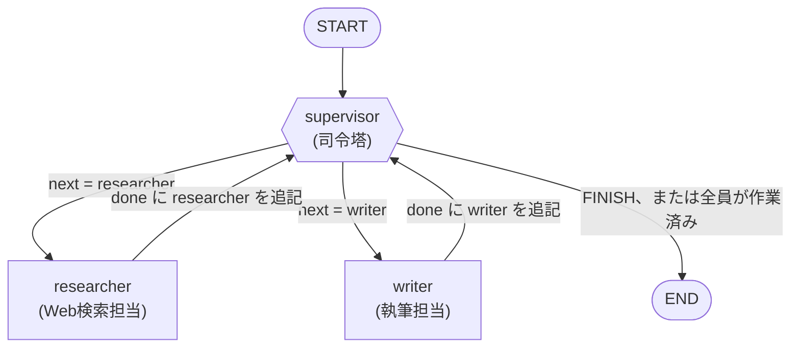

# LangGraph ハンズオン: ローカルLLM(Ollama)で作るマルチエージェント連携

## この資料について

LangGraphを使って、複数のAIエージェントが役割分担しながら協力してタスクを解決する
「マルチエージェント・システム」をゼロから構築するハンズオンです。LLMは
[Ollama](https://ollama.com/) でローカル実行するため、クラウドAPIキーは不要です。

### 対象者

- Pythonの基礎文法がわかる
- LangChain / LLM APIを使ったことがある(初めてでも進められますが、Step1〜2のペースが速く感じるかもしれません)
- LangGraphは未経験〜触ったことがある程度

### 学習目標

1. LangGraphの基本概念(State / Node / Edge / Graph)を理解する
2. ツール呼び出し(Function Calling)を使ったReActエージェントを実装できる
3. `Command` を使った動的なノード遷移で、Supervisor型のマルチエージェント構成を実装できる
4. エージェントのループが止まらない問題(`GraphRecursionError`)の原因を切り分け、
   終了条件を設計できる
5. Checkpointer(記憶)を使って会話を継続できるCLIアプリを作れる

### 所要時間の目安

60〜90分

### ディレクトリ構成

```
langgraph-handson/
├── README.md                       # このファイル
├── requirements.txt                 # 依存パッケージ
├── tools.py                         # 共通ツール(Web検索・電卓)
├── step1_basic_graph.py             # Step1: 最小構成のグラフ
├── step2_react_agent_with_tools.py  # Step2: ツールを使うReActエージェント
├── step3_multi_agent_supervisor.py  # Step3: マルチエージェント(Supervisor)★メイン
└── step4_memory_and_cli.py          # Step4: 記憶付きCLIチャット
```

---

## 0. 環境構築

### 0-1. Ollamaのインストールとモデルの取得

1. [https://ollama.com/download](https://ollama.com/download) からOllamaをインストールする
2. ターミナルでOllamaサーバーを起動しておく(通常はインストール後に自動起動します)

   ```bash
   ollama serve
   ```

3. ツール呼び出し(Function Calling)に対応したモデルを取得する。
   本ハンズオンでは例として `qwen2.5:7b-instruct` を使用します。

   ```bash
   ollama pull qwen2.5:7b-instruct
   ```

   > **モデル選びのヒント**
   > ツール呼び出しは全てのモデルが対応しているわけではありません。
   > `qwen2.5` 系、`llama3.1` 系、`mistral-nemo` などが比較的安定して
   > 動作します。
   >
   > **thinkingモデル(qwen3など)を使う場合の注意**: 一部の推論特化モデルは
   > デフォルトで `<think>...</think>` という思考過程を出力してから回答する
   > 「thinking」モードが有効です。環境によっては生成が終端せず応答が
   > 返ってこなくなる不具合が報告されているため、本ハンズオンでは
   > thinkingモードを持たない `qwen2.5:7b-instruct` を標準としています。
   > qwen3系などを試したい場合は自己責任で `ChatOllama(..., reasoning=False)`
   > を試しつつ、応答が返ってこない場合はモデルを切り替えてください。

### 0-2. Python環境の準備

```bash
python -m venv .venv
source .venv/bin/activate  # Windowsの場合は .venv\Scripts\activate

pip install -r requirements.txt
```

### 0-3. 動作確認

```bash
python step1_basic_graph.py
```

LLMからの応答が表示されれば準備完了です。

---

## Step 1: LangGraphの基本 (`step1_basic_graph.py`)

LangGraphのアプリは、次の3つの要素で構成されます。

| 要素 | 役割 |
|---|---|
| **State** | グラフ全体で共有される「状態」。会話履歴などを保持する |
| **Node** | Stateを受け取り、処理を行い、Stateへの更新分を返す関数 |
| **Edge** | どのNodeからどのNodeへ処理を渡すかを定義するつながり |

Step1では、次の1本道だけのグラフを作ります。



```python
class State(TypedDict):
    messages: Annotated[list, add_messages]
```

`Annotated[list, add_messages]` がポイントです。通常のTypedDictのフィールドは
Nodeが値を返すと「上書き」されますが、`add_messages` というReducer関数を
指定すると「リストへの追記」という挙動に変わります。会話履歴を蓄積していく
LangGraphのアプリでは、この書き方がほぼ必須のパターンになります。

```python
def chat_node(state: State) -> State:
    response = llm.invoke(state["messages"])
    return {"messages": [response]}
```

Nodeは全State を返す必要はなく、**更新したい部分だけ**を辞書で返せば十分です。

**実行してみましょう**

```bash
python step1_basic_graph.py
```

---

## Step 2: ツールを使うエージェント (`step2_react_agent_with_tools.py`)

LLM単体では最新情報の検索や正確な計算はできません。そこで「ツール」を
LLMに使わせる仕組み(Function Calling)を導入し、以下のループを実装します。



これは **ReAct(Reasoning + Acting)パターン** と呼ばれ、
「考える→必要ならツールを使う→また考える」を繰り返す、最も基本的な
エージェントの実装パターンです。

ポイントは条件分岐エッジです。

```python
graph_builder.add_conditional_edges(
    "agent", route_after_agent, {"tools": "tools", END: END}
)
```

`route_after_agent` 関数がStateを見て、次に `"tools"` に進むか `END` に進むかを
文字列で返します。LLMの応答(`AIMessage`)に `tool_calls` が含まれていれば
ツールを呼び出す必要がある、と判断しています。

`tools.py` には以下の2つのツールを用意しています(どちらもAPIキー不要です)。

- `web_search`: DuckDuckGoでWeb検索
- `calculator`: 四則演算

**実行してみましょう**

```bash
python step2_react_agent_with_tools.py
```

検索結果を使って回答を組み立てる過程がログに表示されます。

---

## Step 3: マルチエージェント連携(Supervisorパターン)(`step3_multi_agent_supervisor.py`) ★本編

いよいよ本題です。1つのエージェントに全部の役割を持たせる代わりに、
**役割ごとに専門のエージェントを分け、司令塔(Supervisor)が指揮を執る**
構成を作ります。

### 全体構成



- **supervisor**: 会話の状況を見て、次に「researcher」「writer」どちらを
  動かすか、あるいは「もう完了(FINISH)」かを判断する司令塔
- **researcher**: `web_search` ツールを持つReActエージェント。事実情報を集める
- **writer**: 集まった情報をもとに、最終的な回答文を執筆する

### State: 会話履歴と「作業済みメンバー」

```python
import operator

class State(TypedDict):
    messages: Annotated[list, add_messages]
    next: str                                 # supervisorが選んだ次のメンバー(デバッグ用)
    done: Annotated[list[str], operator.add]  # 作業を終えたメンバー
```

`done` は後述のループ対策で使うフィールドです。Reducerに `operator.add` を
指定しているので、各ノードが `{"done": ["writer"]}` を返すだけでリストに
追記されます。Step1で学んだ `add_messages` と同じ「Reducerで追記」の考え方が、
メッセージ以外のフィールドにもそのまま応用できることを確認してください。

### なぜ役割分担するのか?

1つの巨大なプロンプトに「検索もして、要約もして、丁寧な日本語で書いて」と
全部詰め込むよりも、**役割ごとにプロンプトとツールを絞ったほうが、
それぞれの仕事の精度が上がりやすい**というのがマルチエージェント構成の
基本的な狙いです。またチームの構成(担当の追加・削除)を変えやすいという
保守面のメリットもあります。

### Supervisorの実装: 構造化出力によるルーティング

```python
class Router(TypedDict):
    next: Literal["researcher", "writer", "FINISH"]

def supervisor_node(state: State) -> Command[Literal["researcher", "writer", "__end__"]]:
    done = state.get("done", [])
    remaining = [m for m in MEMBERS if m not in done]

    # ガード(b): 全員が作業を終えたらLLMに聞かずに終了する
    if not remaining:
        return Command(goto=END, update={"next": END})

    system = SUPERVISOR_PROMPT.format(
        done=", ".join(done) or "なし",
        remaining=", ".join(remaining),
    )
    router = llm.with_structured_output(Router).invoke(
        [("system", system), *state["messages"]]
    )
    goto = router["next"]

    if goto == "FINISH":
        goto = END
    elif goto in done:
        # 作業済みメンバーを選び直してきた場合は、未作業のメンバーへ回す
        goto = remaining[0]

    return Command(goto=goto, update={"next": goto})
```

`with_structured_output(Router)` を使うことで、LLMの出力を自由文ではなく
`{"next": "researcher"}` のような決まった形式に固定できます。これにより
「次に誰を呼ぶか」を安定してプログラムから扱えます。

`done` / `remaining` を使ったガードは、このルーティングが暴走しないための
仕掛けです。なぜ必要なのかは次の節で見ていきます。

> **補足**: ローカルの小型モデルでは、この構造化出力がうまく機能しない
> (JSON以外のテキストが混ざってパースエラーになる、など)ことがあります。
> その場合は、プロンプトで「1語だけで答えて」と指示し、応答テキストから
> `researcher` / `writer` / `FINISH` というキーワードを単純な文字列一致で
> 抽出する方式に切り替えると安定することがあります。余裕があれば
> 演習問題としてこちらの実装も試してみてください。

### 落とし穴: Supervisorは放っておくと無限ループする

遷移先をLLMに決めさせるグラフで最初にぶつかるのが `GraphRecursionError` です。

```
langgraph.errors.GraphRecursionError: Recursion limit of 15 reached
without hitting a stop condition.
```

実際に `stream(stream_mode="updates")` でルーティングを覗いてみると、
原因がはっきりします。

```
step 0: supervisor → researcher
step 1: researcher
step 2: supervisor → writer
step 3: writer
step 4: supervisor → writer   ← 以降ずっとwriter
step 6: supervisor → writer
step 8: supervisor → writer
```

writerが一度書き終えているのに、supervisorがwriterを選び続けています。
理由は次の3点です。

1. **stateに「誰が作業済みか」の記録がない** — supervisorは会話履歴だけを見て
   毎回ゼロから判断するため、同じメンバーの再選択を止める仕組みが何もない。
2. **メッセージのラベルが誤解を招く** — writerの出力を
   `[writer の回答案]` と書いていると、「案」という語が「まだ未完成」という
   シグナルになり、「最終回答が用意できていればFINISH」という指示に対して
   モデルが「まだ案だからwriterを続行」と判断しやすくなる。
3. **終了判断を完全にLLM任せにしている** — 7Bクラスのローカルモデルは
   「もう終わっていい」という判断が特に苦手で、FINISHを選べない。

対策として、Step3のコードには2つのガードを入れています。

- **(a) 作業済みメンバーをstateに記録し、プロンプトに明示する**
  `done` フィールドを用意し、`SUPERVISOR_PROMPT` に
  「すでに作業を終えたメンバー」「まだ作業していないメンバー」を差し込んで、
  「作業済みのメンバーを再度選んではいけません」と指示する。
- **(b) 終了条件をプログラム側で持つ**
  全メンバーが作業を終えたらLLMに聞かず `END` へ。加えて、作業済みメンバーを
  選び直してきた場合は未作業のメンバーへフォールバックさせる。

これで `supervisor → researcher → supervisor → writer → supervisor → END` の
5ステップで安定して終了します。

> **教訓**: **遷移はLLMに決めさせても、終了条件はコード側で持つ。**
> LLMの判断に「いつ止まるか」まで委ねると、モデルが小さいほど止まりません。
> これはSupervisorパターンに限らず、エージェントのループ設計全般に効く原則です。
> ラベルや語尾ひとつ(「回答案」か「最終回答」か)がLLMの判断を左右する、
> というプロンプト設計の生々しい例としても覚えておいてください。

### `Command` によるノード遷移

Step2までは `add_edge` / `add_conditional_edges` でノード同士のつながりを
事前に固定していました。Step3では代わりに、**ノード自身が「次にどこへ進むか」
を返す** `Command` オブジェクトを使っています。

```python
return Command(goto="supervisor", update={"messages": [...]})
```

`goto` に次のノード名を指定し、`update` にStateへの更新分を渡します。
これにより、supervisor → researcher → supervisor → writer → supervisor → END
のような**動的で複雑な行き来**を、事前に大量の `add_edge` を書かずに
シンプルに表現できます。返り値の型ヒント `Command[Literal["supervisor"]]` は
「このノードが遷移しうる先」をLangGraphに伝えるためのものです。

### researcher / writer の実装

`researcher_node` は Step2 で学んだReActパターンを `create_react_agent`
という便利関数で簡潔に実装し、最後に `Command(goto="supervisor", ...)` で
supervisorに処理を戻しています。

`writer_node` はツールを持たないシンプルなLLM呼び出しノードです。

どちらのノードも、supervisorに戻る際に `update` で `done` に自分の名前を
追記します。

```python
return Command(
    goto="supervisor",
    update={
        "messages": [("ai", f"[writer の最終回答]\n{response.content}")],
        "done": ["writer"],
    },
)
```

**実行してみましょう**

```bash
python step3_multi_agent_supervisor.py
```

`recursion_limit` はエージェント同士の行き来が想定より多くなった場合の
安全装置です(デフォルトは25)。Step3のコードでは明示的に15を指定しています。
ただしこれは**あくまで最後の砦**で、ループそのものを防ぐものではありません。
上限に引っかかるようになったら、値を増やす前に「なぜ止まらないのか」を
`stream()` で確認するのが正しい順序です。

---

## Step 4: 会話の記憶とCLIチャット (`step4_memory_and_cli.py`)

ここまでの `graph.invoke()` は毎回まっさらな状態から実行していました。
実際のチャットアプリでは「前の会話を覚えている」必要があります。

```python
checkpointer = MemorySaver()
graph = graph_builder.compile(checkpointer=checkpointer)
```

`MemorySaver` をコンパイル時に渡し、実行時に `thread_id` を指定するだけで、
その `thread_id` ごとにStateの履歴が自動的に保存・復元されます。

```python
config = {"configurable": {"thread_id": thread_id}, "recursion_limit": 15}
result = graph.invoke({"messages": [("user", user_input)]}, config)
```

**実行してみましょう**

```bash
python step4_memory_and_cli.py
```

複数回質問を続けて、以前のやり取りを踏まえた回答が返ってくることを
確認してください。

> **補足**: `MemorySaver` はプロセスを終了すると記憶も消えるインメモリの
> Checkpointerです。永続化したい場合はLangGraphが提供する
> SQLite/Postgres向けのCheckpointerに差し替えられます(本ハンズオンの範囲外)。

---

## 演習問題

余裕があれば、以下にチャレンジしてみてください。

1. **メンバー追加**: `reviewer`(レビュー担当)エージェントを追加し、
   writerが書いた回答をチェックして、問題があればwriterに差し戻す
   フローに拡張してみましょう。
   なお現在の `done` によるガードは「各メンバーは1回だけ作業する」前提なので、
   差し戻し(writerの2回目の実行)を許すにはガードの作り直しが必要です。
   例えば `done` の代わりに「差し戻し回数」をstateに持たせ、上限に達したら
   強制的に `END` へ向かわせる、といった設計が考えられます。
   **どう作り替えても「有限回で必ず止まる」ことは保証してください。**
2. **ツール追加**: `tools.py` に新しいツール(例: 現在日時を返す関数)を
   追加し、researcherに使わせてみましょう。
3. **Human-in-the-loop**: supervisorがFINISHと判断する前に、
   人間に「この回答でよいか」を確認するステップを挟んでみましょう
   (`interrupt` の利用がヒントになります)。
4. **プロンプト改善**: `SUPERVISOR_PROMPT` や `WRITER_PROMPT` を調整し、
   ルーティング精度や文章の質がどう変わるか比較してみましょう。

---

## トラブルシューティング

| 症状 | 対処 |
|---|---|
| `ConnectionError` が出る | `ollama serve` が起動しているか確認する |
| モデルが見つからないと言われる | `ollama pull qwen2.5:7b-instruct` を実行したか確認する |
| ツール呼び出しがうまくいかない/構造化出力でエラーになる | モデルをツール呼び出し対応のもの(`qwen2.5`系、`llama3.1`系など)に変更する |
| 何分待っても応答が返ってこない(ハングする) | 一部のthinkingモデル(qwen3系など)はOllama側の不具合で生成が終端しないことがある。`ollama run <モデル名> "テスト"`をLangGraphを介さず単体で実行して同様にハングするか切り分け、ハングする場合はthinkingモードを持たないモデル(`qwen2.5:7b-instruct`など)に変更する |
| `GraphRecursionError` で止まる | supervisorが同じメンバーを選び続けている可能性が高い。まず `graph.stream(..., stream_mode="updates")` で各ステップの遷移先を出力して原因を特定する。値を増やすのではなく、作業済みメンバーをstateに記録してプロンプトに明示し、終了条件をコード側で持つ(Step3「落とし穴」の節を参照) |
| Web検索がエラーになる | ネットワーク接続を確認する。DuckDuckGo側のレート制限の場合は少し待って再実行する |

---

## 参考リンク

- [LangGraph 公式ドキュメント](https://langchain-ai.github.io/langgraph/)
- [LangGraph Multi-Agent Supervisor (公式パッケージ)](https://github.com/langchain-ai/langgraph-supervisor-py)
- [Ollama 公式サイト](https://ollama.com/)
- [langchain-ollama 統合ドキュメント](https://docs.langchain.com/oss/python/integrations/chat/ollama)
